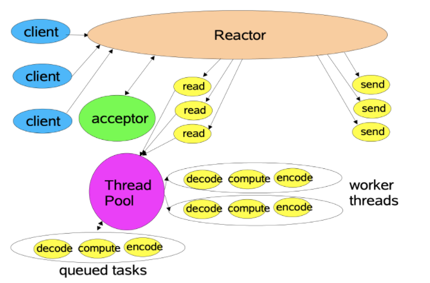

# Java笔记

[TOC]

## 1. 语法和特性

### 1.1 反射与代理

反射：运行过程中，对于任意类，可以获取该类的所有属性和方法。任意对象，调用它的任意方法和属性（包括私有）。

优点：

- 动态加载类，可被用于完成代理

缺点：

- 性能瓶颈

  

（argodbbar client 与master通信，rpc框架）

其他参考：笔记[UML与设计模式-笔记.md](https://github.com/tianjiqx/notes/blob/master/software_project/UML/UML%E4%B8%8E%E8%AE%BE%E8%AE%A1%E6%A8%A1%E5%BC%8F-%E7%AC%94%E8%AE%B0.md) 介绍了远程代理


代理：

- 控制和管理访问
  - 远程对象，智能引用，多线程访问的同步代理，隐藏复杂功能，写时复制等
  - 保护代理，保护对象特定属性
    - 不同的调用处理器InvocationHandler，所能做事情不同


#### REF

- [java反射机制](https://mp.weixin.qq.com/s?__biz=MzI1NDU0MTE1NA==&mid=2247483785&idx=1&sn=f696c8c49cb7ecce9818247683482a1c&chksm=e9c2ed84deb564925172b2dd78d307d4dc345fa313d3e44f01e84fa22ac5561b37aec5cbd5b4&scene=0#rd)  java核心技术卷1 5.7    代理 6.5 
- hadoop 技术内幕common，mapreduce，yarn
- hadoop 权威指南4版


### 1.2 java classloader

classloader技术：

双亲委托

- 避免重复加载class
- 保留优先层级关系

特性：

- java class标识， 二进制的class定义（来源与jar包或其他方式）和对应的classLoader唯一标识该类
  - 两个class比较的时候， 如isInstance, asInstance，任意一个不匹配将认为不等

- 通过new创建的对象，继承父对象的Class loader，在一个已经存在的对象，方法中通过setContextClassLoader修改classloader不会生效，new的对象仍然是默认的AppClassLoader
  Thread.currentThread().setContextClassLoader(classLoader)可修改线程的ClassLoader
  只有在修改之后，通过反射创建的对象，这个对象再创建的对象会是修改后的classloader

- 继承的对象load时，先load自身，再load父类
  依然使用该class loader并且子类与类自身的classLoader可不同（通过自定义的classLoader，override loadClass方法中指定其他的classloader可以做到）
  但是，子类与父类接口参数返回值使用的class的class Loader，需要保持一致，否则运行时报错


应用：spark 支持兼容版本hive，Presto 支持不同数据源， 联邦计算项目


tips:

- 生命周期
  - 加载
    - 方法区，运行时数据结构
    - 堆区，java.lang.Class对象，访问方法区数据结构的入口
  - 链接
    - 验证
    - 准备
    - 解析
  - 初始化
  - 使用
  - 卸载
- 加载一个类时，其内部类不会同时被加载。
  - 一个类被加载，当且仅当其某个静态成员（静态域、构造器、静态方法等）被调用时发生。 for 单例模式实现
  - 被动引用
    - 通过子类引用父类静态字段，不会导致**子类**初始化
      - 父类会
    - 通过数组定义引用类，不会触发此类的初始化
      - `SuperClass[] supArr= new SuperClass[10];`
    - 引用常量时，常量在编译阶段会存入类的常量池中，本质上并没有直接引用到定义常量的类，因此也不会触发类的初始化。
- 加载器
  - 启动类BootStrap class Loader的类加载器
  - 扩展类Extension class Loader
  - 应用程序类Application class Loader
  - 用户自定义类加载器，继承URLClassLoader
- 加载类的方式
  - new关键字
  - 反射Class.forName
    - 默认初始化
  - 调用classLoder的loadClass方法
    - 默认不进行链接，则也不做后面的初始化
- 触发类的初始化（主动引用）
  - 使用 new 关键字实例化对象的时候，读取或设置一个类的静态字段（该字段不被 final 修饰）的时候，以及调用一个类的静态方法的时候；
  - 使用 java.lang.reflect 包的方法对类进行反射调用
  - 初始化类时，父类未初始化，需要先初始化父类
  - jvm启动，的main类
  - 一个 java.lang.invoke.MethodHandle 实例最后的解析结果为 REFgetStatic、REFputStatic、REF_invokeStatic 的方法句柄,并且这个方法句柄所对应的类没有进行过初始化（未理解）
- 类加载的执行顺序优先级：静态块>main()>构造块>构造方法
  - 静态代码块：用staitc声明，jvm加载类时执行，仅执行一次
  - 构造代码块：类中直接用{}定义，每一次创建对象时执行。
  - 静态块>main()是指一个类包含main()方法，同时有静态块，类被加载时会先执行静态块，之后才会执行main方法。


#### REF

- 深入理解Java虚拟机JVM高级特性与最佳实践 第2版-周志明
- [ava 虚拟机 3 ： Java的类加载机制](https://crazyfzw.github.io/2018/07/12/classloader/)
- JVM和ClassLoader
  https://www.cnblogs.com/Ming8006/p/11818218.html
- Spark对HiveMetastore客户端的多版本管理、兼容性探究以及栅
  栏实现 https://blog.csdn.net/zhanyuanlin/article/details
  /95898018 
- [slides: classloader](https://github.com/tianjiqx/slides/blob/master/Java%20ClassLoader.pdf)


### 1.3 JNI参考文档

（NBU项目，使用到jni技术）

官方API说明：

https://docs.oracle.com/javase/8/docs/technotes/guides/jni/spec/jniTOC.html

Java Native Interface(JNI)从零开始详细教程：

https://blog.csdn.net/createchance/article/details/53783490#t18

编译相关：在 Linux 平台下使用 JNI

https://developer.ibm.com/zh/articles/l-linux-jni/

JNI最佳实践（编码的性能与正确性）

https://developer.ibm.com/articles/j-jni/

JNI语法相关（注意接口需要  (*env)->，方式，并传递env）：

https://github.com/glumes/AndroidDevWithCpp

JNI技术规范

**https://www.jianshu.com/p/88fbe27621fc**


## 2. 并发

### 2.1 线程池ThreadPoolExecutor

导入导出项目中，并发的实现。

```java
//ThreadPoolExecutor
  
 /*
 public ThreadPoolExecutor(int corePoolSize,
                          int maximumPoolSize,
                          long keepAliveTime,
                          TimeUnit unit,
                          BlockingQueue<Runnable> workQueue,
                          ThreadFactory threadFactory,
                          RejectedExecutionHandler handler)
corePoolSize- 要保留在池中的线程数，即使它们处于空闲状态，除非allowCoreThreadTimeOut已设置
maximumPoolSize - 池中允许的最大线程数
                - 当工作队列满时，提交新任务时，会尝试创建非core线程进行处理
keepAliveTime - 当线程数大于核心数时，这是多余空闲线程在终止前等待新任务的最长时间。
unit-keepAliveTime参数的时间单位
workQueue- 用于在执行任务之前保存任务的队列。这个队列将只保存方法Runnable 提交的任务execute。
threadFactory - 执行器创建新线程时使用的工厂
handler - 由于达到线程边界和队列容量而阻塞执行时使用的处理程序，饱和策略
**/
private ThreadPoolExecutor downloadThreadPool;
// Init the thread pool to download file
downloadThreadPool = new ThreadPoolExecutor(impExpContext.exportThreadPoolSize,
                                            impExpContext.exportThreadPoolSize, 
                                            0L,
                                            TimeUnit.MICROSECONDS,
                                            // 默认值是Integer.MAX_VALUE，
                                            // 一般情况下不会饱和，但可能jvm OOM
                                            new LinkedBlockingQueue<Runnable>(impExpContext.exportThreadPoolQueueSize),
                                            Executors.defaultThreadFactory(), 
                                            new BlockWhenQueueFullHandler()
                                           );
// 存放需要下载文件的任务，后面通过downloadThreadPool.execute() 
// 封装为可执行对象，逐一提交到线程池的任务队列
fileTaskQueue = new LinkedBlockingQueue<>(impExpContext.exportFileQueueSize);

// execute(Runnable command)
// 提交可执行任务，SubFileDownloader继承了runable 接口
downloadThreadPool.execute(new SubFileDownloader(subFileInfo, activeCount,
                                                 hadoopContext.dfs, hadoopContext.ccf));
/**
ThreadPoolExecutor是线程池的核心实现类，用来执行被提交的任务。
ScheduledThreadPoolExecutor是一个实现类，可以在给定的延迟后运行命令，或者定期执行命令。 ScheduledThreadPoolExecutor比Timer更灵活，功能更强大。
*/
```

在hadoop的源码中的使用线程池，发现也是继承ThreadPoolExecutor的HadoopThreadPoolExecutor（org.apache.hadoop.util.concurrent包目录下），只是增加日志。


**Java创建线程有三种方式**

- 实现Runable接口
  - 需要实现`void run()` 方法
  - 通过`new Thread(Runable r).start()` 运行 
  - 优势：
    - Runable是接口，可以有多个实现
    - 可以被多个Thread实例，共用Runable对象，共享数据
- 实现Callable接口
  - 与 Runnable 相比， Callable 可以有返回值，抛出异常， 返回值通过 FutureTask 进行封装
    - `V call() throws Exception;`
  - `new Thread(new FutureTask<T>(Callable<T> c)).start()` 运行
  - `FutureTask.get()` 获取接口
- 直接继承Thread类


**BlockingQueue 阻塞队列**

- `LinkedBlockingQueue`
  - 链式阻塞队列，底层数据结构是链表，默认大小是Integer.MAX_VALUE，可以指定大小
- `ArrayBlockingQueue`
  - 数组阻塞队列，底层数据结构是数组，需要指定队列的大小
  - `new ArrayBlockingQueue<>(QUEUE_CAPACITY)`
- `SynchronousQueue`
  - 同步队列，内部容量为，不存储元素，每个put操作必须等待一个take操作
- `DelayQueue`
  - 延迟队列，想要获取的元素需要等待指定延迟时间后，才能从队列中获取到该元素

**RejectedExecutionHandler 饱和策略**

- ThreadPoolExecutor.AbortPolicy：默认拒绝处理策略，丢弃任务并抛出RejectedExecutionException异常。
- ThreadPoolExecutor.DiscardPolicy：丢弃新来的任务，但是不抛出异常。
- ThreadPoolExecutor.DiscardOldestPolicy：丢弃队列头部（最旧的）的任务，然后重新尝试执行程序（如果再次失败，重复此过程）。
- ThreadPoolExecutor.CallerRunsPolicy：由调用线程处理该任务。（推荐）
  - `new ThreadPoolExecutor.CallerRunsPolicy()`
  - 由调用线程中执行被拒绝的任务，可能影响提交任务（执行`ThreadPool.execute()`的线程，主线程或者说提交线程）


阿里 Java 开发手册的建议：

- 不允许自己显示创建线程，而创建线程池
  - 减少在创建和销毁线程上所花的时间以及系统资源的开销（内存，切换）
- 也不允许Executors创建，而是通过ThreadPoolExecutor 的方式（手动设置任务队列容量，以及饱和策略）
  - FixedThreadPool 和 SingleThreadPool，允许的请求队列长度为 Integer.MAX_VALUE ，可能OOM
  - CachedThreadPool 和 ScheduledThreadPool，允许的创建线程数量为 Integer.MAX_VALUE，也可能导致OOM


#### REF

- [jdk1.8 ThreadPoolExecutor](https://docs.oracle.com/javase/8/docs/api/java/util/concurrent/ThreadPoolExecutor.html)
- [Java多线程之ThreadPoolExecutor详解使用](https://www.cnblogs.com/dim2046/p/12059073.html)
- [java&android线程池-Executor框架之ThreadPoolExcutor&ScheduledThreadPoolExecutor浅析（多线程编程之三）](http://blog.csdn.net/javazejian/article/details/50890554)
- [jdk1.8 java.lang.Runnable](https://docs.oracle.com/javase/8/docs/api/java/lang/Runnable.html)
- [jdk1.8 java.util.concurrent.Callable](https://docs.oracle.com/javase/8/docs/api/java/util/concurrent/Callable.html)
- [深入浅出Java多线程-ThreadPoolExecutor](https://crazyfzw.github.io/2020/11/13/concurrent-thread-pool-executor/)  demo使用，原理  推荐


### 2.2 ThreadLocal

目的：

多线程执行的代码，访问的数据，每个单线程独立使用，提供线程本地实例对象，线程局部变量。

#### 2.2.1 使用场景：

- 消息队列，消费者处理持续处理自身负责的消息
- 线程内上线文管理器、数据库连接，RPC通信 客户端
- 每个线程维护一个用户session，持续处理用户请求
- 一个线程，需要传递的对象（上下文（Context）），横跨若干方法进行处理，适合通过ThreadLocal完成在一个线程中传递同一个对象
  - 一般定义为私有静态字段


#### 2.2.2 使用范例

```java
 import java.util.concurrent.atomic.AtomicInteger;
 // 线程ID生成、获取器
 public class ThreadId {
     // Atomic integer containing the next thread ID to be assigned
     private static final AtomicInteger nextId = new AtomicInteger(0);

     // Thread local variable containing each thread's ID
     private static final ThreadLocal<Integer> threadId =
         new ThreadLocal<Integer>() {
         	// 定义创建线程局部变量的方法
             @Override protected Integer initialValue() {
                 return nextId.getAndIncrement();
         }
     };
     /*
     另一种初始化方法：
     private static ThreadLocal<Integer> mLocal = 
     	ThreadLocal.withInitial(() -> nextId.getAndIncrement());
     */

     // Returns the current thread's unique ID, assigning it if necessary
     public static int get() {
         // 通过get()方法获取线程自己的对象，不存在创建。
         return threadId.get();
         // 其他公有的方法： 
         // set(T value)  设置线程副本的执行
         // remove() 删除线程局部变量的当前线程值，再次get时，通过initialValue()方法重新初始化
         // 静态方法withInitial(Supplier<? extends S> supplier) 创建线程局部变量
      }
 }
```

#### 2.2.3基本原理

为了达到ThreadLocal的作用，一种可能的实现是，ThreadLocal 变量 自己维护一个ConcurrentHashMap\<thread， value> ，但是该方法的缺点是：

- 需要加锁访问ConcurrentHashMap\<thread， value>，保证线程安全
- 线程结束，需要释放资源，避免内存泄漏

（BAR项目 master对于client连接，也是通过该方式完成，注册加入，长时间无请求时的释放，注册不频繁，性能影响不大）


解决ThreadLocal变量 访问冲突的方式是，每个线程维护ThreadLocal 变量与值的映射ThreadLocalMap< ThreadLocal, value>，但是需要注意对ThreadLocal 变量引用的回收，避免内存泄漏。


JDK的实际的实现：

```java
public class ThreadLocal<T> {

    private final int threadLocalHashCode = nextHashCode();
    private static AtomicInteger nextHashCode =
        new AtomicInteger();
    private static final int HASH_INCREMENT = 0x61c88647;

    private static int nextHashCode() {
        return nextHashCode.getAndAdd(HASH_INCREMENT);
    }
    public T get() {
        Thread t = Thread.currentThread();
        // 从线程中获取ThreadLocalMap
        ThreadLocalMap map = getMap(t);
        if (map != null) {
            ThreadLocalMap.Entry e = map.getEntry(this);
            if (e != null) {
                @SuppressWarnings("unchecked")
                T result = (T)e.value;
                return result;
            }
        }
        return setInitialValue();
    }
    public void set(T value) {
        Thread t = Thread.currentThread();
        ThreadLocalMap map = getMap(t);
        if (map != null)
            map.set(this, value);
        else
            createMap(t, value);
    }
     public void remove() {
         ThreadLocalMap m = getMap(Thread.currentThread());
         if (m != null)
             m.remove(this);
     }
	// 从线程中获取ThreadLocalMap
    ThreadLocalMap getMap(Thread t) {
        return t.threadLocals;
    }
    // 为线程创建ThreadLocalMap
    void createMap(Thread t, T firstValue) {
        // key: this 是ThreadLocal对象 value: firstValue 
        t.threadLocals = new ThreadLocalMap(this, firstValue);
    }
	// 每个线程自己维护的map，ThreadLocal变量和该线程的值
    static class ThreadLocalMap {
		// 对ThreadLocal变量的弱引用，当没有强引用指向ThreadLocal变量时，它可被回收，避免内存泄漏
        // 对值是强引用，值可能由于key为null，无法移除entry，导致泄漏
        // 解决办法是:set方法中通过replaceStaleEntry/cleanSomeSlots清除所有null的key
        // rehash中，expungeStaleEntry清除所有null的key
        static class Entry extends WeakReference<ThreadLocal<?>> {
            /** The value associated with this ThreadLocal. */
            Object value;

            Entry(ThreadLocal<?> k, Object v) {
                super(k);
                value = v;
            }
        }

        private static final int INITIAL_CAPACITY = 16;
        private Entry[] table;
        private int size = 0;
        // resize
        private int threshold; // Default to 0

        ThreadLocalMap(ThreadLocal<?> firstKey, Object firstValue) {
            table = new Entry[INITIAL_CAPACITY];
            int i = firstKey.threadLocalHashCode & (INITIAL_CAPACITY - 1);
            table[i] = new Entry(firstKey, firstValue);
            size = 1;
            setThreshold(INITIAL_CAPACITY);
        }
        
        private Entry getEntry(ThreadLocal<?> key) {
            int i = key.threadLocalHashCode & (table.length - 1);
            Entry e = table[i];
            if (e != null && e.get() == key)
                return e;
            else
                return getEntryAfterMiss(key, i, e);
        }

        private Entry getEntryAfterMiss(ThreadLocal<?> key, int i, Entry e) {
            Entry[] tab = table;
            int len = tab.length;

            while (e != null) {
                ThreadLocal<?> k = e.get();
                if (k == key)
                    return e;
                if (k == null)
                    expungeStaleEntry(i);
                else
                    i = nextIndex(i, len);
                e = tab[i];
            }
            return null;
        }
    }    
}
```

最佳实践：

对于内存泄漏，Thread.exit()会令threadLocals=null，最终会释放ThreadLocalMap，让其能够回收。

但是如果使用的是线程池，那么就有可能因为，线程一致活着，导致ThreadLocal对象的泄漏。

那么最好的做法，是避免key为null的ThreadLocalMap的entry产生，在线程对自己ThreadLocal对象使用完后，调用remove方法，去除自己线程管理的entry（ThreadLocal变量的弱引用与值）。


#### REF

- [jdk8 api: ThreadLocal<T>](https://docs.oracle.com/javase/8/docs/api/java/lang/ThreadLocal.html)
- [深入浅出Java多线程-ThreadLocal](https://crazyfzw.github.io/2020/11/25/threadlocal/)
- [使用ThreadLocal](https://www.liaoxuefeng.com/wiki/1252599548343744/1306581251653666)
- [一篇文章，从源码深入详解ThreadLocal内存泄漏问](https://github.com/CL0610/Java-concurrency/blob/master/18.%E4%B8%80%E7%AF%87%E6%96%87%E7%AB%A0%EF%BC%8C%E4%BB%8E%E6%BA%90%E7%A0%81%E6%B7%B1%E5%85%A5%E8%AF%A6%E8%A7%A3ThreadLocal%E5%86%85%E5%AD%98%E6%B3%84%E6%BC%8F%E9%97%AE%E9%A2%98/%E4%B8%80%E7%AF%87%E6%96%87%E7%AB%A0%EF%BC%8C%E4%BB%8E%E6%BA%90%E7%A0%81%E6%B7%B1%E5%85%A5%E8%AF%A6%E8%A7%A3ThreadLocal%E5%86%85%E5%AD%98%E6%B3%84%E6%BC%8F%E9%97%AE%E9%A2%98.md)


### 2.3 synchronized

`synchronized`同步关键字，用于保证只有单个线程进程操作。

使用方式：

- 普通方法
  - 对当前对象加锁
- 静态方法
  - 当前 `Class` 对象
- 代码块
  - `synchronized() {}`
  - `()` 中的对象
    - `(xxx.class)` class的所有对象
    - `(this)`,`(object)` 单个对象

原理：

java 编译期，生成对monitor的 enter和exit指令，排他的对monitor的占用。

java底层对加锁过程，锁的变化，有一定的优化。


REF

- [synchronized 关键字原理](https://crossoverjie.top/2018/01/14/Synchronize/)


### 2.4 BlockingQueue & BlockingDeque

单向队列BlockingQueue 关键方法：

|      | 抛出异常   | 返回特定值(true/false) | 阻塞    | 超时                        |
| ---- | ---------- | ---------------------- | ------- | --------------------------- |
| 插入 | add(o)     | offer(o)               | put(o)  | offer(o, timeout, timeunit) |
| 移除 | remove(o)  | poll(o)                | take(o) | poll(timeout, timeunit)     |
| 检查 | element(o) | peek(o)                |         |                             |

双端队列BlockingDeque。同名函数增加First/Last后缀。


常用的实现类：

- ArrayBlockingQueue 数组实现，有界
- LinkedBlockingQueue 链表实现，可以设置大小
- DelayQueue 维持特定的延迟
- PriorityBlockingQueue 优先级，无界
  - ` java.util.PriorityQueue `
- SynchronousQueue 同步队列，单元素


REF

- [JUC集合: BlockingQueue详解](https://www.pdai.tech/md/java/thread/java-thread-x-juc-collection-BlockingQueue.html)


## 3.IO

### 3.1 Java NIO

（ArgoDBBAR项目，网络通信机制依赖netty；数据拷贝性能改进使用到filechannel）

#### IO分类

- 同步阻塞I/O：socket.read()，如果TCP RecvBuffer里没有数据，函数会一直阻塞，直到收到数据，返回读到的数据
- 非阻塞IO：数据未准备好时，也能正常返回，准备好时，正常处理数据
- IO复用：linux的select/poll机制，支持多个fd的读写，顺序扫描fd状态，以支持IO复用
  - epoll：基于事件驱动代替select/poll的顺序扫描
- NIO：基于IO复用的非阻塞IO，事件驱动
  - selector 轮询
- AIO(异步IO)：不但等待就绪是非阻塞的，就连数据从网卡到内存的过程也是异步的。内核通知IO完成
  - 订阅-通知及机制，非轮询


**IO复用**


#### 概念

- Selector：多路复用器。用以轮询注册的channel是否就绪，就绪后进行IO操作
  - 事件订阅
    - 注册，处理OS的事件
  - Channel管理
    - 注册
    - 分发事件

- Channel：通道

- Buffer：缓冲区
  - 对通道的读写操作进行合并


#### 传统IO模型


Server端使用OS线程池处理任务。

缺点：

- 服务器的并发量取决于服务器工作线程数，工作线程数无法提到很高
- IO读写，CPU计算耦合，无法充分利用资源
- IO是阻塞类型，受会受网络波动，降低服务器利用资源率

#### Reactor事件驱动模型


优点：

- 单线程处理网络请求，一定程度解耦，网络请求与处理分离，提高处理效率
- 异步非阻塞模型，不受网络请求IO波动影响


**业务处理与IO分离**



- 一个线程进行客户端连接的接收以及网络读写事件的处理
  - reactor线程
- 客户端连接之后，将该连接交由线程池进行数据的编解码以及业务计算

优点：

- 进一步的解耦处理逻辑，网络读写与业务计算分离

缺点：

- 单线程处理高并发的网络请求，存在瓶颈

**并发读写**


- Reactor拆分
  - mainReactor 负责客户端连接的处理
  - subReactor 通过线程池，处理网络IO读写
- 业务逻辑计算，也通过线程池进行处理


#### REF

- [Java NIO浅析-美团技术团队](https://tech.meituan.com/2016/11/04/nio.html)
- [Java NIO 系列教程-并发编程网译文](https://ifeve.com/java-nio-all/)
- Netty权威指南 第2版-李林峰
- [ByteBuffer浅显易懂的图解原理](https://greedypirate.github.io/2019/12/01/ByteBuffer%E6%B5%85%E6%98%BE%E6%98%93%E6%87%82%E7%9A%84%E5%9B%BE%E8%A7%A3%E5%8E%9F%E7%90%86/#ByteBuffer)
- [Java NIO - IO多路复用详解](https://www.pdai.tech/md/java/io/java-io-nio-select-epoll.html)
- [Java AIO](https://www.pdai.tech/md/java/io/java-io-aio.html)


扩展材料：

- [Java 异步编程](https://www.baeldung.com/java-asynchronous-programming)  一些库，框架
- [Java FutureTask](https://www.pdai.tech/md/java/thread/java-thread-x-juc-executor-FutureTask.html)


## 4. 最佳实践

### 4.1 Java性能诊断技巧

- jps：查看java进程，默认只
  - `jps -v` 输出虚拟机进程启动时JVM参数
  - `jps -l` 输出主类的全名,jar包路径
  - `jps -m` 输出传递给主类main()函数的参数
  - `jps -q` 只输出pid
- jinfo：查看和调整虚拟机运行参数，环境变量，classpath等信息
  - `jinfo <pid>`

- jstack：线程分析，找项目相关类方法
  - `jstack <pid>`

- jmap：定期打印jvm状态，查看异常变量，对象
  - `jmap -histo:live <pid> |head 30`  显示堆中对象统计信息，包括类、实例数量、合计容量
    - 有时，需要`sudo -u hive` 来指定用户
  - `jmap -heap <pid>` 显示堆详细信息
  - `jmap -dump <pid>`  生成Java堆转储快照
    - -dump:[live, ]format=b,file=filename,其中live子参数说明是否只dump出存活的对象

- jhat：分析jmap 打印的dump文件，可在浏览器中查看
  - `jhat <dumpfile>`
- jstat: 查看GC频率
  - `jstat -gcutil <pid> [interval] [count]` 百分比显示，JVM堆使用情况

- arthas: trace,watch命令，分析性能，变量，查找抛出异常的位置


GC日志打印，停顿时间

扩展材料：

- [调试排错 - Java问题排查：工具单](https://www.pdai.tech/md/java/jvm/java-jvm-debug-tools-list.html)  btrace, dmesg


### 4.2 JVM 参数

例子：-vmargs -Xms128M -Xmx512M -XX:PermSize=64M -XX:MaxPermSize=128M

-vmargs 声明后面是VM的参数

- 堆内存
  - -Xms 128m JVM初始分配的堆内存
  - **-Xmx** 512m JVM最大允许分配的堆内存，按需分配

- 新生代内存(Young Ceneration, YC) 
  - 默认1310MB,最大无显著
  - -XX:NewSize= \<young size>[unit] 
  - -XX:MaxNewSize= \<young size>[unit]
  - -Xmn \<young size>[unit] 
    - NewSize与MaxNewSize 设置为一致
- 永久代/元空间
  - -XX:PermSize=64M JVM初始分配的非堆内存（方法区），在jdk1.8 无效参数
    - 方法区 (永久代) 初始大小
    - 存储类的信息、常量池、方法数据、方法代码等
    - 所有线程共享
  - -XX:MaxPermSize=128M JVM最大允许分配的非堆内存，按需分配
    - 方法区 (永久代) 最大大小,超过这个值将会抛出 OutOfMemoryError 异常:java.lang.OutOfMemoryError: PermGen
      - “PermGen space“ HotSpot的实现
  - JDK 1.8 方法移除永久代，使用元空间（本地内存）
    - 元空间，JVM方法区的新实现
      - 元空间的大小仅受本地内存限制
        - 风险：没有指定 Metaspace 的大小时，消耗系统所有内存
      - 异常信息：:java.lang.OutOfMemoryError: Metaspace
      - 替代原因：
        - 字符串存在永久代中，容易出现性能问题和内存溢出
        - 类及方法的信息等比较难确定其大小，因此对于永久代的大小指定比较困难
    - -XX:MetaspaceSize=N
    - -XX:MaxMetaspaceSize=N


**GC**

- 指定垃圾回收器  （TODO）
  - -XX:+UseSerialGC  串行垃圾回收器
    - Serial + Serial Old 
  - -XX:+USeParNewGC 并发串行垃圾收集器， 多线程并发，减少回收时间
    - ParNew + Serial Old 
  - -XX:+UseParallelGC 并行收集器，多CPU物理并行，最大化的提高程序吞吐量，同时缩短程序停顿时间
    - ParallelScavenge  + Serial Old
  - -XX:+UseConcMarkSweepGC   CMS 回收器，基于“标记-清除”算法，以获取最短回收停顿时间为目标
    - ParNew + CMS + Serial Old，作为并发失败后备 Serial Old
  - -XX:+UseG1GC  G1垃圾收集器，多线程执行，既用于新生代收集，也用于老生代收集
- 指定GC日志（TODO more）
  - ```
    -XX:+PrintGC  // 别名 -verbose:gc
    -XX:+PrintGCDetails
    -Xloggc:/path/to/gc.log
    ```

活跃数据：Full GC后，堆中老年代占用空间的大小

各区分配：`总堆=3~4 * 活跃数据 = 1~1.15 （新）+ 2~3 （老） + 1.2~1.5 * 活跃数据 (永久) `


GC调优经验： Full GC 的成本远高于 Minor GC，尽量将新对象预留在新生代，大对象/长期存活的对象进老年代


#### REF

- [最重要的JVM参数指南](https://github.com/Snailclimb/JavaGuide/blob/master/docs/java/jvm/%E6%9C%80%E9%87%8D%E8%A6%81%E7%9A%84JVM%E5%8F%82%E6%95%B0%E6%8C%87%E5%8D%97.md)
- [Java8内存模型—永久代(PermGen)和元空间(Metaspace)](https://www.cnblogs.com/paddix/p/5309550.html)
- [java8添加并查看GC日志(ParNew+CMS)](https://segmentfault.com/a/1190000021453229)
- [JVM GC 日志详解](https://juejin.cn/post/6844903791909666823)
- [java9 gc log参数迁移](https://www.jianshu.com/p/a99dec3230c9)


